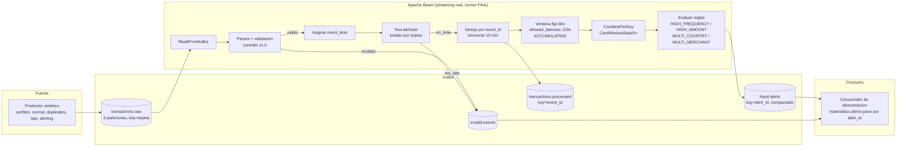

# Arquitectura

## Diagrama

## Componentes

| Componente | Rol |
|---|---|
| **Productor sintetico** (`producer/`) | Genera transacciones deterministas (seed) segun un perfil: `normal`, `duplicates` (reenvia el mismo `event_id`), `late` (desorden y atraso, dentro y fuera de la politica), `alerting` (concentra actividad para disparar las 4 reglas). Publica en `transactions.raw` con `key`=tarjeta tokenizada. |
| **Kafka** | Broker en modo KRaft (sin Zookeeper). `transactions.raw` con 3 particiones para paralelizar por tarjeta conservando el orden por partición. `fraud.alerts` compactado por `alert_id` para simular materialización del último resultado. |
| **Beam — validacion** (`beam_pipeline/validation.py`) | Valida cada evento contra `contracts/transaction_schema.json` (JSON Schema). Separa validos/invalidos; los invalidos van a `invalid.events` con el motivo. |
| **Beam — TooLateGateFn** (`beam_pipeline/pipeline.py`) | Gate explicito de tardanza por tarjeta: compara el `event_time` de cada evento contra el maximo visto para esa tarjeta; si el atraso supera ventana+lateness, lo enruta a `invalid.events` en vez de dejarlo llegar a la ventana. Se implementa a nivel de aplicacion como defensa explicita ademas del `allowed_lateness` nativo del `WindowInto` (ver Límites, motivado originalmente por una limitacion del DirectRunner). El maximo visto por tarjeta esta acotado (no avanza mas de `max_future_skew_seconds` por un solo evento, evita que un `event_time` anomalo corrompa el gate) y expira via timer tras `ttl_seconds` de inactividad de la tarjeta. |
| **Flink** (`jobmanager` + `taskmanager`) | Cluster de streaming que ejecuta el pipeline. El `taskmanager` (imagen propia, `flink/taskmanager.Dockerfile`) lanza un contenedor efimero por worker del SDK harness -- necesita el socket de Docker del host montado y, junto con el `jobmanager`, correr en red host (`network_mode: host`), lo que requiere Docker con soporte real de red tipo host: Linux nativo o WSL2 con Docker Engine, no Docker Desktop (ver `documento_tecnico.md`, seccion de limites, para el detalle completo). |
| **Beam Flink Job Server** (`beam_flink_job_server`) | Recibe el pipeline sometido por `beam_pipeline` (`PortableRunner`) y lo traduce/despacha al cluster de Flink. |
| **Beam — Dedup** (`beam_pipeline/dedup.py`) | `DoFn` con estado (`ReadModifyWriteStateSpec`) y timer: recuerda si ya vio un `event_id` durante 10 minutos; un reenvio dentro de ese horizonte se descarta. |
| **Beam — Ventana y reglas** (`beam_pipeline/rules.py`) | Ventana fija de 60s, `allowed_lateness=120s`, trigger de watermark + disparo tardio simple, modo `ACCUMULATING`. `CardWindowStatsFn` agrega de forma incremental (conteo, monto, países, comercios distintos) sin materializar la lista completa de eventos. `EvaluateRulesFn` construye 0..N alertas con `alert_id` estable. |
| **Consumidor de demostracion** (`consumer/`) | Consume `fraud.alerts` e `invalid.events`; materializa en memoria el último valor por `alert_id` (simulando lo que Kafka hace al compactar) e imprime un resumen. |

## Modelo de ejecucion del pipeline

`beam_pipeline` somete el grafo del pipeline al cluster de Flink como un job de **streaming real** (sin cota de
lectura), via `PortableRunner` y el job server oficial de Beam (`beam_flink_job_server`). Es el resultado de
migrar desde una primera version que corria en DirectRunner con micro-lotes acotados -- un workaround
necesario en ese runner que dejo de ser necesario al pasar a Flink. `docker-compose.yml` reinicia
automaticamente `beam_pipeline` (`restart: unless-stopped`) si el envio del job falla.

**Estado verificado**: streaming real y continuo contra Kafka -- corrida de referencia con 130 eventos
publicados, 117 procesados y 46 alertas distintas materializadas con las 4 reglas disparando, job estable sin
caidas. Los workers del SDK harness se lanzan como contenedores "hermanos" con `--network=host` para
reconectarse al `taskmanager`, que por eso corre (junto con el `jobmanager`) en red host tambien -- esto
requiere Docker con soporte real de red tipo host (Linux nativo o WSL2 con Docker Engine; Docker Desktop para
Windows/Mac no lo soporta). Ver la seccion de limites de `documento_tecnico.md` para el diagnostico completo
del camino hasta este estado, incluyendo el bug de coder en el cruce Python↔Java que -- una vez resuelta toda
la infraestructura -- resulto ser la causa real de que el job corriera sin emitir datos.

## Por que estos tópicos y esa clave

`transactions.raw` usa la tarjeta tokenizada como clave: conserva el orden de eventos de una misma tarjeta dentro de una partición (necesario para el dedup y la agregación por ventana) y permite paralelismo entre tarjetas distintas. `fraud.alerts` usa `alert_id = tarjeta|window_start|window_end|alert_type` como clave: es estable frente a reintentos o paneles posteriores de la misma ventana, lo que permite que un consumidor (o la compactación de Kafka) materialice solo el último resultado por alerta, sin duplicarla.
